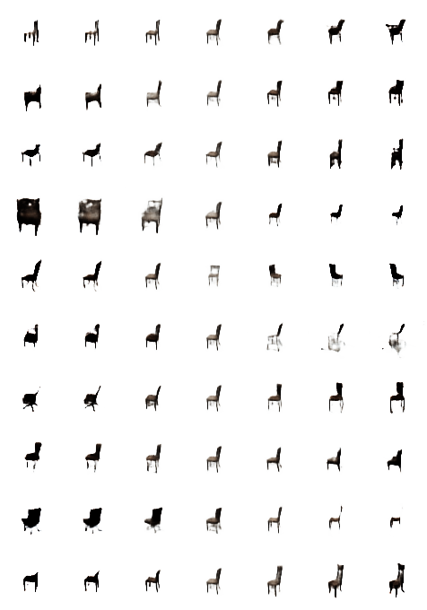
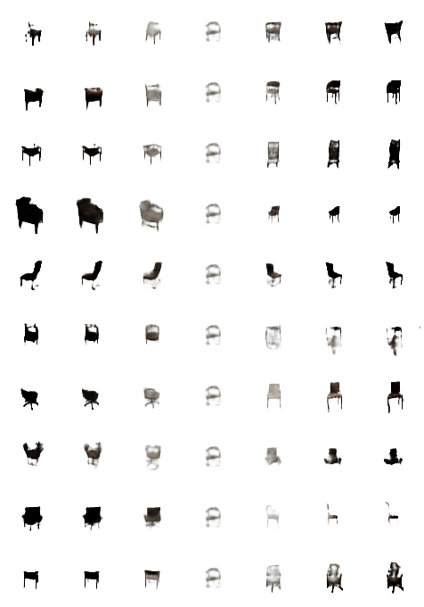
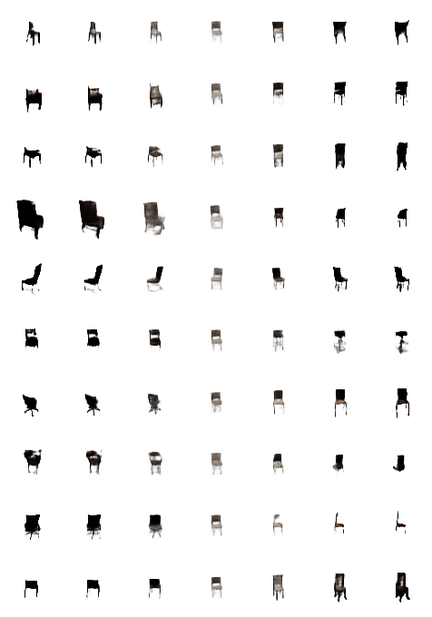
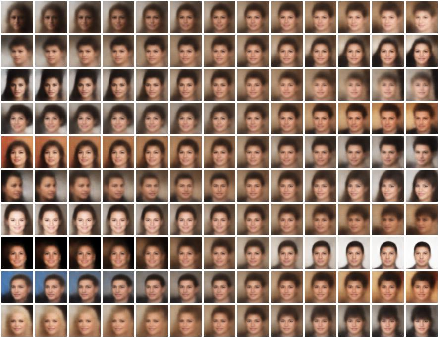

# FactorVAE
Pytorch implementation of FactorVAE proposed in Disentangling by Factorising, Kim et al.([http://arxiv.org/abs/1802.05983])
<br>

### Dependencies
```
python 3.6.4
pytorch 0.3.1.post2
visdom
```
<br>

### Datasets
1. 3D Chairs Dataset([Aubry et al.])([click to download])
2. CelebA Dataset([website])

and make sure you follow desired dataset directory tree supported by Pytorch ImageFolder Class.<br>
for example,
```
.
└── data
    └── CelebA
        └── img_align_celeba
            ├── 000001.jpg
            ├── 000002.jpg
            ├── ...
            └── 202599.jpg
    ├── 3DChairs
        └── rendered_chairs1
            ├── xxx.png
            ├── ...
       └── rendered_chairs2
            ├── xxx.png
            ├── ...
    └── ...
```
<br>

### Usage
initialize visdom
```
python -m visdom.server -p 55558
```
you can run codes using sh files
```
e.g.
sh run_celeba.sh
sh run_3dchairs.sh
```
or you can run your own experiments by setting parameters manually
```
e.g.
python main.py --viz_name run1 --dataset celeba --gamma 6.4 --lr_VAE 1e-4 --lr_D 5e-5 --z_dim 10 ...
```
check training process on the visdom server
```
localhost:55558
```
after training, you can see traverse results(see below) using ```--viz_name```
```
python main.py --train False --viz_name run1
```

<br>

### Results - 3D Chairs Dataset
each row represents each dimension of latent vector z(i.e. z_j, j=1, ..., 10)

#### Latent Space Traverse 1(representation from true image 1)

#### Latent Space Traverse 2(representation from true image 2)

#### Latent Space Traverse 3(representation from zero vector)

#### Latent Space Traverse 4(representation from normal distribution)


### Results - CelebA Dataset
each row represents each dimension of latent vector z(i.e. z_j, j=1, ..., 10)

#### Latent Space Traverse (representation from random normal vector)


<br>

### Reference
1. Disentangling by Factorising, Kim et al.([http://arxiv.org/abs/1802.05983])


[http://arxiv.org/abs/1802.05983]: http://arxiv.org/abs/1802.05983
[Aubry et al.]: http://www.di.ens.fr/~josef/publications/aubry14.pdf
[click to download]: https://www.di.ens.fr/willow/research/seeing3Dchairs/data/rendered_chairs.tar
[website]: http://mmlab.ie.cuhk.edu.hk/projects/CelebA.html
